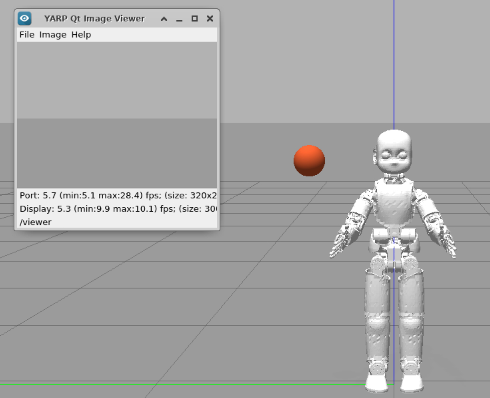
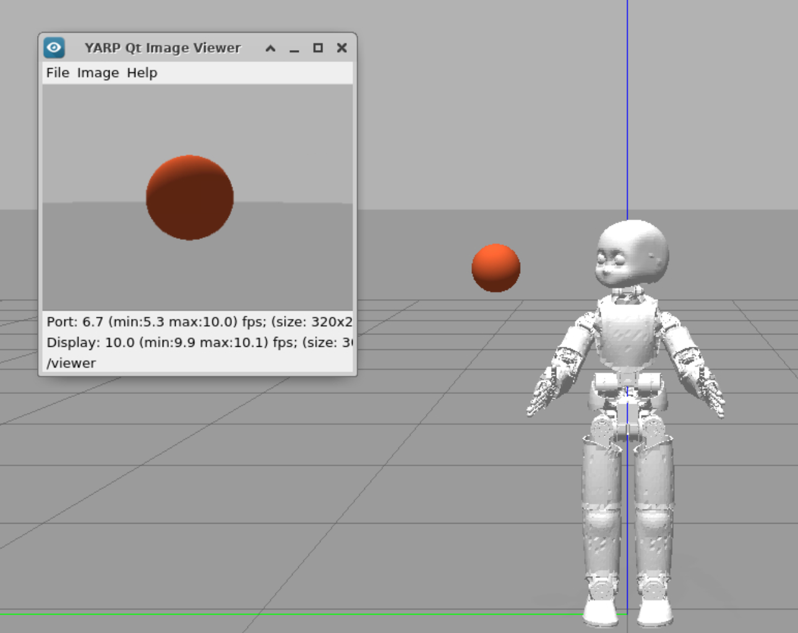

Design a simple vision-based test
===========================================

[](https://gitpod.io/#https://github.com/vvv-school/assignment_yarp-find-rgb)

# Prerequisites

For this assignment, you just need to be aware of:
- [yarp::os::Bottle](http://www.yarp.it/classyarp_1_1os_1_1Bottle.html);
- [yarp::os::BufferedPort](http://www.yarp.it/classyarp_1_1os_1_1BufferedPort.html);
- [yarp::dev::IEncoders](http://www.yarp.it/classyarp_1_1dev_1_1IEncoders.html), [yarp::dev::IPositionControl](http://yarp.it/classyarp_1_1dev_1_1IPositionControl.html) and [yarp::dev::IControlMode](http://yarp.it/classyarp_1_1dev_1_1IControlMode.html);
- [yarp::sig::Image](http://www.yarp.it/classyarp_1_1sig_1_1Image.html) and [yarp::sig::PixelRgb](http://www.yarp.it/structyarp_1_1sig_1_1PixelRgb.html).

# Assignment

Before starting working on the robot, we need to check :flashlight: if everything is working fine :wrench:.
Particularly, we want to check if the **robot neck** and **eyes** are ok or not.

We ask you to **design a simple test** to check all these functionalities.

- The robot stands in its wonderful world and a colorful ball pops up next to it :sparkles:.
- We want to test the robot cameras, by checking  if they are able to **detect the correct ball color**.
- However, the ball is not located in front of the robot view (:smiling_imp:). Look for the ball while moving the robot head, until the robot can stare at this wonderful ball! This way, we can check also if the neck is working.


In practice, the test should be designed like that:

- Control the robot head with a simple **position control**. **Pay attention**:warning: the robot head has 6 DOF (degrees-of-freedom):


 the first 3 **qN** (joint no. 0,1,2) control the neck, the last 3 **qE** (joint no. 3,4,5) control the eyes positions. **Hint**  :four_leaf_clover:: moving a single neck joint is enough for accomplish the test,
guess which one!
- **Read the image** coming from one of the robot cameras and **send the RGB code** of the **image center** through a port. Our tester will read
this value and will check if everything is working fine! :white_check_mark:


### How to interact with the code:
**Write through a port**: your code should receive the angle value through a `BufferedPort`. 
While you are developing your code, you can send this message through the terminal:

- open a `BufferedPort` to communicate with your module
```
$ yarp write /angle-port
```
and you will get something like that
```
yarp: Port /angle-port active at tcp://192.168.14.1:10060/
yarp: Sending output from /angle-port to /head/ang:i using tcp
>>
```
- connect your port thorugh the _yarpmanager scripts_ provided from within [**app/scripts**](./app/scripts);
- now send the angle value:
```
>>angle 10.0
```

**Read from a port**: you can check the RGB code sent from your code:
- read from a `BufferedPort`:
```
$ yarp read /color-port 
```
- connect using the  _yarpmanager scripts_ provided from within [**app/scripts**](./app/scripts);
- you should see something like that (for instance):
```
yarp: Port /color-port active at tcp://192.168.14.1:10061/
yarp: Receiving input from /head/color:o to /color-port using tcp
yarp: Removing input from /head/color:o to /color-port
yarp: Receiving input from /head/color:o to /color-port using udp
184.0 199.0 207.0
```

## Requirements to meet
The test is considered fully passed if you are able to:
1. correctly implement the position control and choose the head joint to move;
2. correctly send the data through the port;
3. acquire the RGB code from the correct pixel of the image;

### Score map

| Requirements | Points |
|:---:|:---:|
| 1 | 5 |
| 2 | 5 |
| 3 | 5 |
| **Maximum score** | 15 |


## Expected output

The ball appears next to the robot, but the robot is not looking at it! (**Pay attention** :warning:: the ball position is always the same, whereas the color magically changes 
every time you run your code :smiling_imp:)



At the end of your test, you should get something like that:



## How to proceed
We provide you with a starter code that contains missing gaps you have to fill in. Don't panic, most of the software is already done and, where missing, is full of comments to help you out!

Once done, you can test your code in two ways:

1. **Manually**: running the _yarpmanager scripts_ provided from within [**app/scripts**](./app/scripts). This will help you interact with your code.
1. **Automatically**: [running the script **test.sh**](https://github.com/vvv-school/vvv-school.github.io/blob/master/instructions/how-to-run-smoke-tests.md) in the **smoke-test** directory. This will give you an idea of how many points you might score.


# [How to complete the assignment](https://github.com/vvv-school/vvv-school.github.io/blob/master/instructions/how-to-complete-assignments.md)


